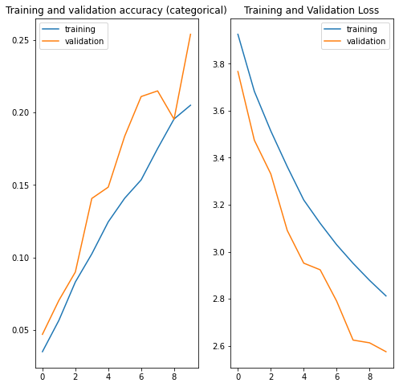
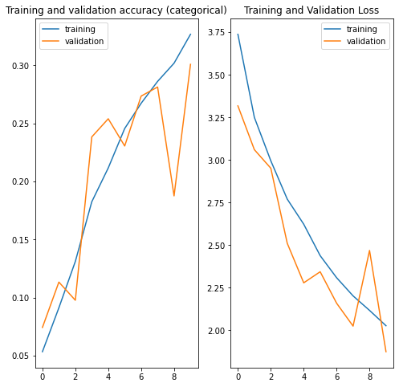
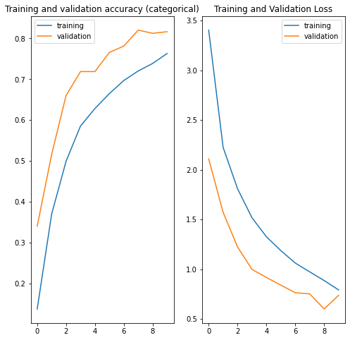
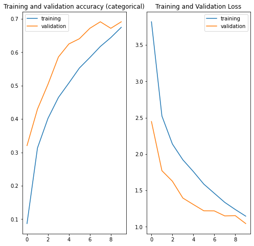
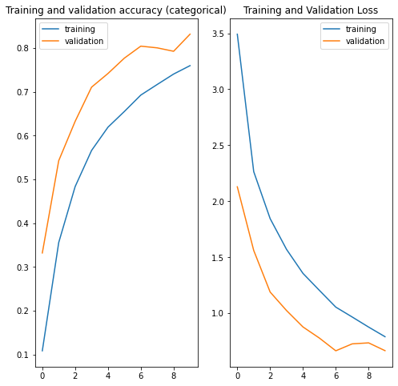
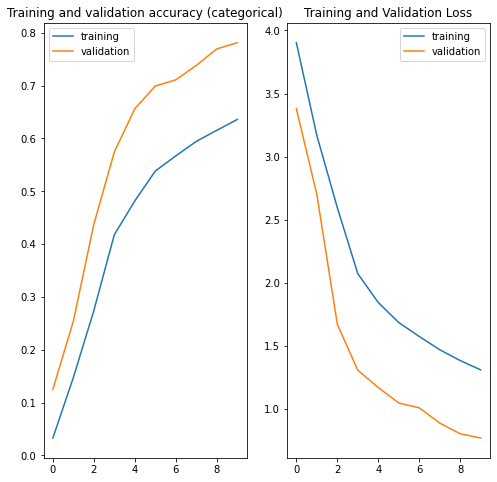
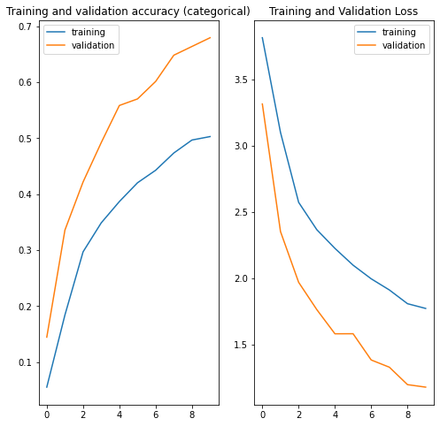
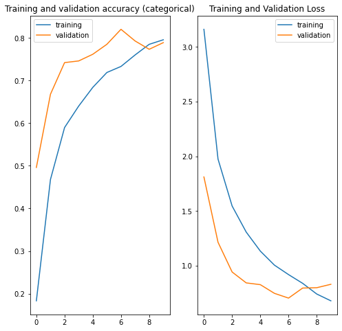

Sebastian Gattinger | S2110454002

# AKT3 Part I: CNN project
### Dataset
The initial idea, was to classify garbage but due to lacking training data (and it's quality), first results where rather frustrating. Thus I decided to try classifying **playing cards** instead. \
The used data set can be found on [Kaggle](https://www.kaggle.com/datasets/gpiosenka/cards-image-datasetclassification).

#### Content & Structure
The dataset contains training, validation and test directories, each containing the same nested directories representing the individual playing cards by their name.
- classes: 53
- train images: 7624
- validation images: 265
- test images: 265

### Models & Results
*This is just an overview of the tested (relevant) models. The models themselves, explanations, thoughts and other notes are contained in the Jupyter Notebook. If not specified otherwise, using batch size 32.*

The following models are in chronological order with the development process and thus can also be seen as some kind of tiny "changelog". 

#### MobileNetV3 (Large)
Even though the graphs suggest growth in accuracy and a "working" learning process, the quality of the predictions stays pretty low (20-25% best). \
Also I haven't been that successful with other pre-trained models aswell, why I sticked with custom models from there on. \

#### Own Model 1
Comparably small to medium sized, using kernel size 3. \
 \
This first model was performing terrible, so i started playing around and:
- reduced kernel size to 2
- slightly adapted layers

for my second model.
#### Own Model 2
 \
As observable, these changes had a huge impact. Apart from not only actually kind of working, this model is also competing for being the best of all experiments.
#### Own Model 3
Tried a simpler model with less and also thinner layers: \
 \
Performed a bit worse than before.

#### Own Model 4
A bit bigger, but still compact: \
 \
The moderate increase of complexity showed a positive impact on the performance.

#### Own Model 5
Added another layer and increased neurons a bit: \
 \
Increased complexity results in similar validation, but worse training accuracies.
#### Own Model 6
Another rather simple model but used with different learning rates. Increasing the LR ruined the results quite easily, while small reasonable reductions do not have that much of an effect. \
Significant reductions led to worse  training performances (but nearly as accurate validation performances). The default value seems to be quite fitting for this dataset. \
Learning rate in the graph: 0.0005 \
 \

#### Own Model 4, different batch size
Using model 4 once again, but with a batch size of 16 instead of 32. \
This led to an accelerated learning process in the first epochs, but also stalls earlier and thus doesn't really deliver better results overall. \

